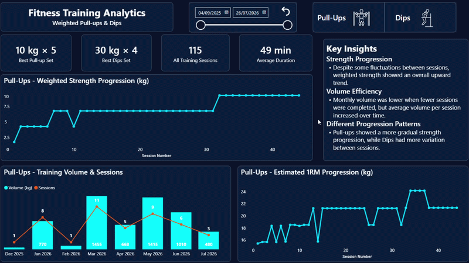
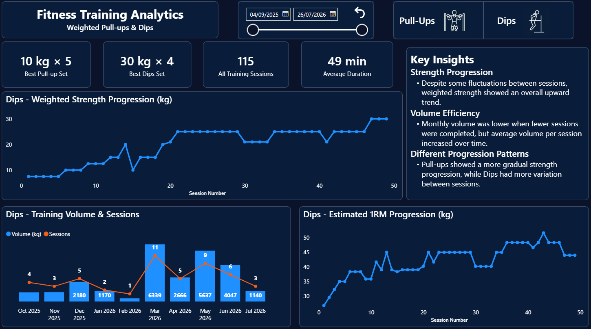
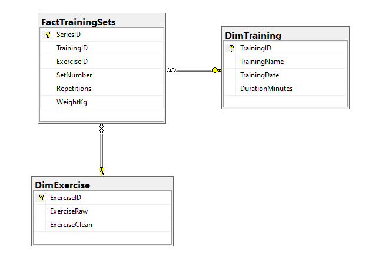
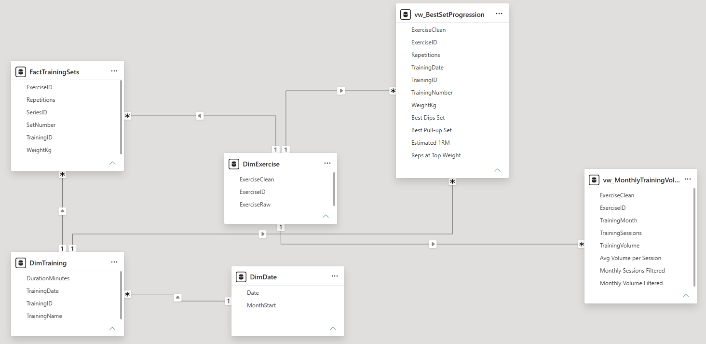
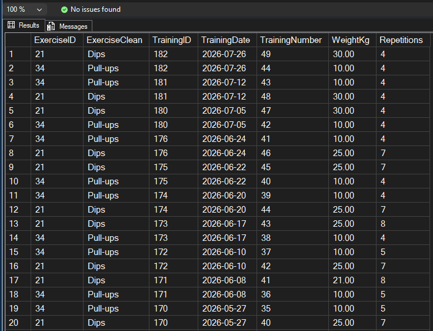
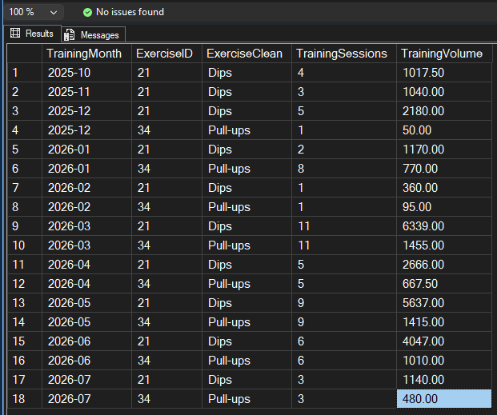

# 🏋️ Fitness Data Analysis

## 📝 Project Overview

This is a data analysis project based on my personal training data from the Gymlify app.

The dataset covers approximately 7–10 months of training history, depending on the exercise being analyzed. The main goal was to analyze strength progression in weighted Pull-ups and Dips, compare changes over time, and calculate additional performance metrics.

The project resulted in an interactive Power BI dashboard presenting the analysis and key insights.

## 📊 Dashboard Preview

The final Power BI dashboard analyzes strength progression, training volume, and estimated 1RM for weighted Pull-ups and Dips.

The report includes interactive bookmarks for switching between Pull-ups and Dips, while tooltips provide additional details at different levels of analysis. The Pull-ups screenshot below shows several tooltips in use.

View Pull-ups Dashboard

View Dips Dashboard

## 🎯 Project Goal

The main goal of the project was to analyze how weighted Pull-ups and Dips progressed over time.

I focused on strength progression, changes in estimated 1RM, and monthly training volume. I also compared monthly training volume, the number of training sessions, and average volume per session.

## 🛠️ Tools & Technologies

| Tool                   | Usage                                                                                                                       |
| ---------------------- | --------------------------------------------------------------------------------------------------------------------------- |
| **SQLite**             | Inspected the raw `.sqlite3` database and extracted key columns into a staging table.                                       |
| **SQL Server** | Cleaned and transformed the data, built the Star Schema, and created analytical views for Power BI.                         |
| **DAX**                | Created the date table and analytical measures, including estimated 1RM, KPI metrics, and virtual filtering with `TREATAS`. |
| **Power BI**           | Built an interactive and easy-to-understand dashboard for analyzing the training data.                                      |

## 🔄 Data Pipeline

The process started with inspecting the raw SQLite database and extracting the required data into a staging table. The data was then cleaned and transformed in SQL Server, where I built a Star Schema and prepared analytical views.

Finally, I created DAX measures and used the prepared data to build an interactive Power BI dashboard.

## 🗄️ Data Model — Star Schema

The data model was designed using a Star Schema approach. It consists of one fact table, `FactTrainingSets`, and two dimension tables: `DimTraining` and `DimExercise`.

`FactTrainingSets` stores data at the individual set level, while the dimension tables provide descriptive information about training sessions and exercises.

The Power BI model extends the SQL Server model by including the analytical views and the `DimDate` table used for time-based analysis.

View SQL Server Star Schema

View Power BI Data Model

## 🧹 Data Preparation & Analytical Layer

After building the data model, I prepared an analytical layer in SQL Server. I cleaned and standardized the data and created two analytical views which were later used in Power BI.

- `vw_BestSetProgression` — prepares data for weighted strength progression analysis.
- `vw_MonthlyTrainingVolume` — aggregates monthly training volume and the number of training sessions.

The screenshots below show selected fragments of the analytical views.

View Analytical Views

### Strength Progression

### Monthly Training Volume

## 🧮 DAX & Measures

In Power BI, I used DAX to create a date table and prepare the measures needed for the analysis. The measures include, among other things, estimated 1RM based on the Epley formula, best sets used in KPI cards, average volume per session, and virtual filtering of monthly data using `TREATAS`.

The full list of measures with short descriptions is available in the [DAX measures documentation](DAX/measures.md).

## 💡 Key Insights

### Strength Progression

Despite some fluctuations between sessions, weighted strength showed an overall upward trend.

### Volume Efficiency

Monthly volume was lower when fewer training sessions were completed, but the average volume per session increased over time.

### Different Progression Patterns

Pull-ups were characterized by a more gradual strength progression, while Dips showed more variation between sessions.
